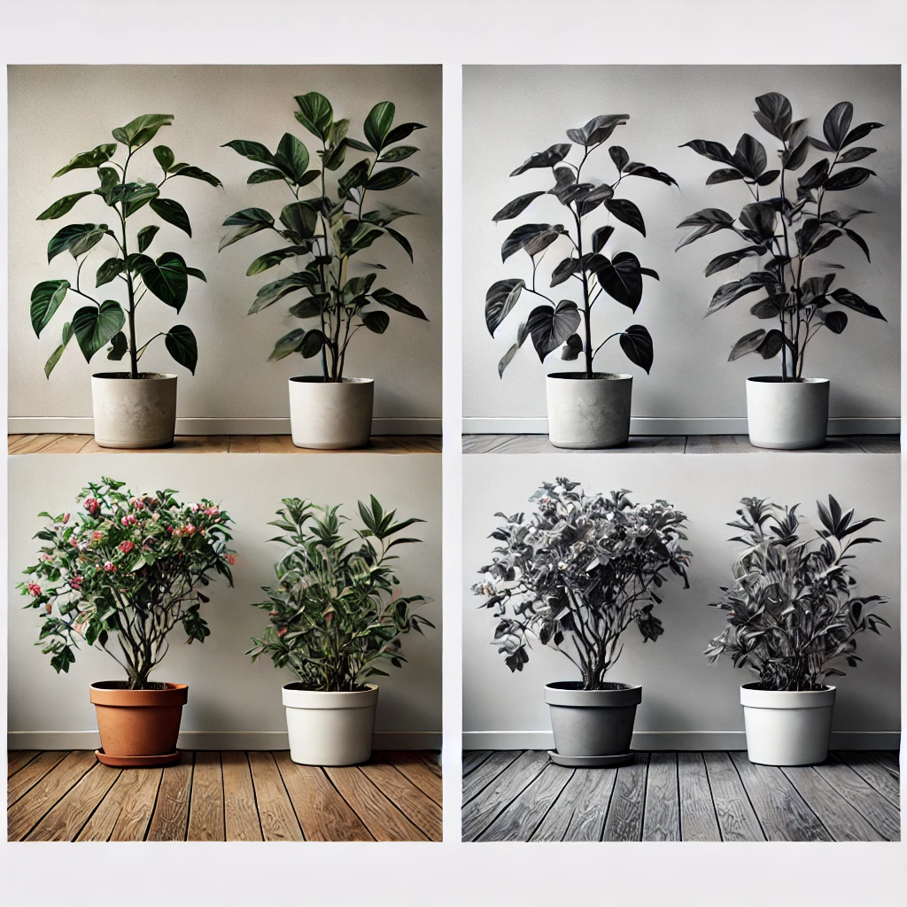
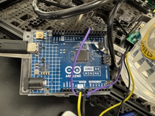
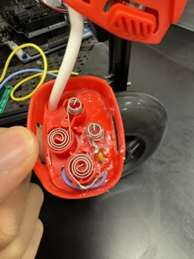
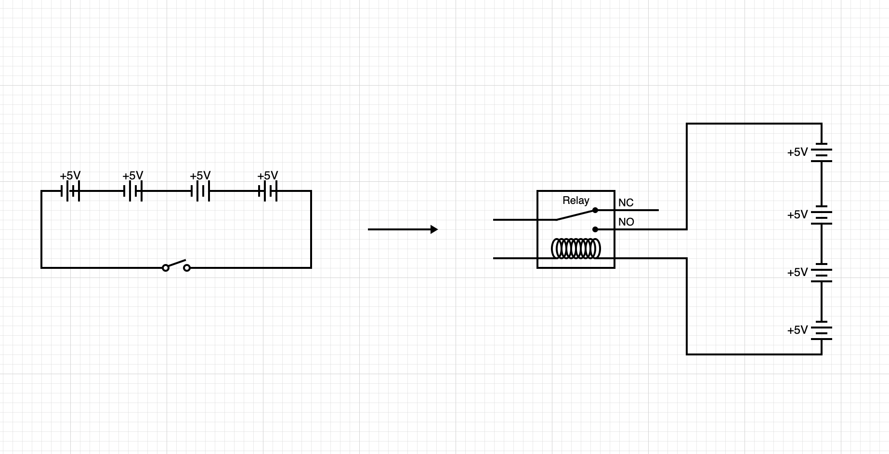

## Table of Contents

- [Introduction](#introduction)
    - [Project Goals](#project-goals)
    - [Inspiration](#inspiration)
    - [Objective](#objective)
- [Challenges](#challenges)
    - [Flask Server](#flask-server)
    - [Plant Detection](#plant-detection)
    - [Water Sprayer Signaling](#water-sprayer-signaling-system)
    - [Autonomous Navigation](#autonomous-navigation-and-spraying)
- [ROS Structure](#ros-structure)
- [Project Story](#story-of-the-project)

# Introduction

### Autonomous Turtlebot with Precision Watering System

This research project focuses on the development of an autonomous Turtlebot platform equipped with a precision water-dispensing system. The robot will navigate a structured indoor environment to identify and assess plants, determining both the necessity and appropriate quantity of water to apply. This system integrates advanced robotic navigation, computer vision, and AI-driven plant recognition to mimic the efficiency of precision agricultural technologies.


## Project Goals

The Turtlebot will:

- **Autonomously navigate** within a defined space using systematic navigation algorithms.
- Use **computer vision techniques** (e.g., fiducial marker detection via OpenCV) for localization and orientation.
- Leverage **OpenAI-based models** for plant type identification, enabling tailored watering strategies based on plant-specific hydration needs.
- Activate a **water sprayer actuator** to deliver a precise volume of water upon successful identification and analysis of the plant.
- Remote controlled via an web-based application

## Inspiration

- **Technological inspiration:** This project draws inspiration from advanced agricultural robotics, such as sniper robots capable of treating vast crop fields with unparalleled efficiency while using 95% fewer chemicals.
  - [Sniper robot treats 500k plants per hour with 95% less chemicals](https://www.youtube.com/watch?v=sV0cR_Nhac0&ab_channel=Freethink)
- **Personal relevance:** The project also addresses the common issue of plant neglect, inspired by Jiahao's experience with underhydrated and dying plants.

By combining robotics, AI, and precision actuation, this initiative explores innovative solutions for sustainable plant care in agricultural and domestic contexts.

## Objective

The objective of this project is to explore the integration of robotics, artificial intelligence, and precision actuation to solve real-world problems related to plant care and resource management. By leveraging autonomous navigation, image recognition, and intelligent decision-making systems, the project aims to:

- Demonstrate the feasibility of using robotics for sustainable, resource-efficient plant care.
- Develop a scalable framework for integrating AI-driven plant identification into robotic systems.
- Investigate and optimize strategies for precision watering to minimize waste while meeting plant-specific needs.
- Provide insights into the potential of robotic platforms in precision agriculture and domestic gardening.
- Design and implement a system that will handle communication between user input from UI to our robot

This project serves as a proof of concept for innovative approaches to automated plant care, with broader implications for agricultural and environmental sustainability.

# Challenges

## Flask Server and React Frontend Integration for Plant Care Robot

This section explains how to integrate a Flask backend with a React frontend to manage a plant care robot that detects plants, updates instructions, and provides real-time information. Below is the detailed breakdown of the implementation.

---

## Flask Server

The Flask server provides APIs for handling robot instructions and plant data. It also serves the React frontend and handles cross-origin requests using `flask_cors`.

### System Overview


### Key Features of the Flask Server

1. **Serving the React App**:

   - Serves the static React build files and ensures the app loads correctly.

2. **Managing Instructions**:

   - Handles instructions like `GO_HOME`, `SCAN_ALL`, or navigating to specific plants.
   - Includes robust validation to ensure valid instructions are processed.

3. **Managing Plant Data**:

   - Provides a list of detected plants and allows updating the plant list dynamically.

4. **Instruction Feedback Loop**:
   - Periodically prints the current instruction for debugging purposes.

### Flask Code Implementation

```python
from flask import Flask, request, jsonify, send_from_directory
import os
import base64
import time
import threading
from flask_cors import CORS

# Initialize Flask app with static folder for serving React app
app = Flask(__name__, static_folder='build', static_url_path='')
CORS(app)

# Global variables
ALL_INSTRUCTION = ['GO_HOME', 'GO_TO_PLANT_', 'SCAN_ALL', 'NONE']
INSTRUCTION = 'NONE'

# Example plant data (testing purposes)
def jpg_to_base64(image_path):
    with open(image_path, "rb") as image_file:
        return base64.b64encode(image_file.read()).decode('utf-8')

available_plants = [] # [[id, type, img]]

# Function to print current instruction every 5 seconds
def print_instructions():
    while True:
        print(f"Current instruction: {INSTRUCTION}")
        time.sleep(5)

threading.Thread(target=print_instructions, daemon=True).start()

# Routes
@app.route('/')
def serve_react_app():
    return send_from_directory(app.static_folder, 'index.html')

@app.route('/get_plants', methods=['GET'])
def get_available_plants():
    return jsonify(available_plants), 200

@app.route('/get_instruction', methods=['GET'])
def get_instruction():
    global INSTRUCTION
    return jsonify({"instruction": INSTRUCTION}), 200

@app.route('/update_instruction', methods=['POST'])
def update_instruction():
    global INSTRUCTION
    data = request.get_json()
    if not data:
        return jsonify({"error": "Invalid input"}), 400
    instruction = data.get('instruction')
    if instruction not in ALL_INSTRUCTION and not instruction.startswith('GO_TO_PLANT_'):
        return jsonify({"error": "Invalid instruction"}), 400
    INSTRUCTION = instruction
    return jsonify({"message": "Instruction updated successfully"}), 200

@app.route('/update_plants', methods=['POST'])
def update_available_plants():
    global available_plants
    data = request.get_json()
    if not data or 'available_plants' not in data:
        return jsonify({"error": "Invalid input"}), 400
    available_plants = data['available_plants']
    return jsonify({"message": "Available plants updated successfully"}), 200

if __name__ == '__main__':
    app.run(debug=False)
```

### React Frontend

The React frontend fetches data from the Flask API and provides an interactive UI for monitoring and controlling the robot.


#### Key functions of the React Frontend

```javascript

  useEffect(() => {
    const fetchPlants = () => {
      fetch(`${url}/get_plants`)
        .then((response) => response.json())
        .then((data) => {
          // data type: [fiducial_id, plant_type, base_64_image]
          setPlants(data);
        })
        .catch((error) => {
          console.error('Error fetching plants:', error);
          showNotification('Failed to fetch plants');
        });
    };

    fetchPlants(); // Initial fetch
    const intervalId = setInterval(fetchPlants, 3000); // Fetch every 3 seconds

    return () => clearInterval(intervalId); // Cleanup on unmount
  }, []);

  const safeFetch = async (func, params) => {
    try {
      const response = await fetch(`${url}/get_instruction`);
      const res = await response.json();

      if (res.instruction === 'NONE') {
        await func(params); // Add await in case func is async
      } else {
        showNotification('Robot is busy');
      }
    } catch (error) {
      showNotification('Failed to fetch robot status');
    }
  };
  const handleBackToBase = () => {
    console.log('Sending instruction to go home');
    fetch(`${url}/update_instruction`, {
      method: 'POST',
      headers: {
        'Content-Type': 'application/json',
      },
      body: JSON.stringify({ instruction: 'GO_HOME' }),
    })
      .then(() => showNotification('Robot is returning to base'))
      .catch(() => showNotification('Failed to send robot home'));
  };

  const safeHandleBackToBase = () => {
    safeFetch(handleBackToBase);
  };

  const handleDetectPlants = () => {
    console.log('Detecting plants');
    fetch(`${url}/update_instruction`, {
      method: 'POST',
      headers: {
        'Content-Type': 'application/json',
      },
      body: JSON.stringify({ instruction: 'SCAN_ALL' }),
    })
      .then(() => showNotification('Detecting plants'))
      .catch(() => showNotification('Failed to detect plants'));
  };

  const safeHandleDetectPlants = () => {
    safeFetch(handleDetectPlants);
  };

  const handleSprayPlant = (fiducialId) => {
    console.log(`Spraying plant ${fiducialId}`);
    showNotification(`Spraying plant ${fiducialId}`);

    fetch(`${url}/update_instruction`, {
      method: 'POST',
      headers: {
        'Content-Type': 'application/json',
      },
      body: JSON.stringify({ instruction: `GO_TO_PLANT_${fiducialId}` }),
    })
      .then(() =>
        showNotification(
          `Going to ${fiducialId}, plant: ${
            plants.find((plant) => plant[0] === fiducialId)[1]
          }`
        )
      )
      .catch(() => showNotification(`Failed to spray plant ${fiducialId}`));
  };

  const safeHandleSprayPlant = (fiducialId) => {
    safeFetch(handleSprayPlant, fiducialId);
  };

  const showNotification = (message) => {
    setSnackbarMessage(message);
    setOpenSnackbar(true);
  };

  const resetRobot = () => {
    fetch(`${url}/reset_all`, {
      method: 'POST',
      headers: {
        'Content-Type': 'application/json',
      },
      // body: JSON.stringify({ instruction: 'NONE' }),
    })
      .then(() => showNotification('Robot reset'))
      .catch(() => showNotification('Failed to reset robot'));
  };


  
```

1. **Plant Grid**:

   - Displays the detected plants with images, IDs, and types.
   - Allows users to spray a specific plant by clicking a button.

2. **Robot Controls**:

   - Provides buttons to reset the robot, detect plants, and return to base.

3. **Notifications**:
   - Displays success or error messages for user actions.
4. **Safe requests**:
   - Make sure the robot ensures its in idle state before sending instructions

## Plant Detection

Ensuring that the Turtlebot reliably detects the target plant under varying lighting conditions (e.g., shadows or brightness changes) is a critical component of this project. The initial approach involved integrating a YOLOv5 model for real-time plant detection, leveraging resources such as the [Plant Leaf Detection and Classification model](https://huggingface.co/foduucom/plant-leaf-detection-and-classification). However, this approach revealed several limitations:

- **Accuracy**: The model struggled with detecting plants under diverse lighting conditions and varying angles.
- **Versatility**: It lacked adaptability to different environmental settings, which limited its practical application.
- **Computational Load**: The YOLOv5 model was computationally intensive, making it less suitable for real-time deployment on a resource-constrained platform like the Turtlebot.

To address these challenges, the project transitioned to using the **OpenAI GPT-4o-mini model** with advanced vision capabilities. This model demonstrated significantly improved performance by:

- Providing **consistent detection accuracy**, achieving nearly 100% reliability across diverse conditions.
- Offering **restricted outputs** tailored to specific plant identification, enhancing precision.
- Operating with **greater computational efficiency**, making it a more practical option since computation was offloaded to an external API.



#### Implementation Code: Plant Detection with OpenAI GPT-4o-mini

The `Detector` class leverages the GPT-4o-mini model to identify plant types or confirm the presence of a plant in an image. Below is the implementation:

```python
import base64
from openai import OpenAI
from dotenv import load_dotenv
import os

# Load environment variables
load_dotenv()

# Retrieve the OpenAI API key from the environment variables
open_api_key = os.getenv("OPEN_API_KEY")

class Detector:
    def __init__(self):
        self.client = OpenAI(api_key=open_api_key)  # Initialize OpenAI client
        self.MAX_RETRIES = 10  # Maximum retries for API requests
        self.plant_types = ['Cactus', 'Basil', 'Thyme', 'Parsley', 'Gatorade']  # Recognized plant types

    def detect_plant(self, image):
        """
        Detects the type of plant or Gatorade in an image.

        Args:
            image (str): Base64 encoded string of the image.

        Returns:
            tuple: (bool, str) indicating whether detection was successful and the identified plant type.
        """
        for i in range(self.MAX_RETRIES):
            try:
                response = self.client.chat.completions.create(
                    model="gpt-4o-mini",
                    messages=[
                        {
                            "role": "user",
                            "content": [
                                {"type": "text", "text": "Output the plant type or Gatorade and only the plant type in one word: 'Cactus', 'Basil', 'Thyme', 'Parsley', or 'Gatorade' if the image's object of interest contains the plant or Gatorade"},
                                {"type": "image_url", "image_url": {"url": f"data:image/jpeg;base64,{image}"}}
                            ],
                        }
                    ],
                )
                res = response.choices[0].message.content.strip()

                if res in self.plant_types:
                    return True, res
                else:
                    return False, None
            except Exception as e:
                print(f"Failed attempt {i}: {e}")


```

#### Explanation of Key Components


##### Plant Type Detection:

The `detect_plant` method sends a base64-encoded image to the OpenAI GPT-4o-mini model, instructing it to identify the object of interest from a predefined list of plant types (e.g., 'Cactus', 'Basil', etc.) or Gatorade.


##### Retry Mechanism:

Both methods implement a retry mechanism to handle potential API request failures, ensuring robust performance in real-world applications.

This refinement in plant detection methodology highlights the importance of balancing model accuracy, versatility, and computational feasibility in robotics applications. The GPT-4o-mini model proved to be a game-changer, ensuring robust and reliable plant identification for the Turtlebot's precision watering tasks. It can also detect a variety of objects outside of the plant constraints, including a Gatorade bottle.

## Water Sprayer Signaling System:

Create a signaling channel for the turtlebot to control the sprayer through ROS. This requires hardware level development.

One of the biggest challenge for this project was to tackle hardware modifications as a team who has no experience in hardward work.

From a high level, the message transmission path that controls the sprayer goes from

```
publisher -> subscriber (on rasberry pi) -> arduino uno -> relay -> sprayer
transmission type: ROS -> serial -> GPIO pin
```

### Components

There are three main components that goes into making the sprayer remote controllable using ROS publisher.

#### 1. arduino uno
   
   The arduino is responsible for receiving messages from rasberry pi and controlling the relay.
   

#### 2. rasberry pi
   
   The rasberry pi is where the ROS subscriber is run. It listens to published messages and passes it down to arduino uno. 

#### 3. relay
   
   The relay is responsible for controlling the open and close of the circuit loop which triggers the power of the sprayer.

There are 6 ports on the relay. Each of them except NC is required for our setup

- IN: Connects to the Arduino's GPIO pin (e.g., pin 7), this port handles recieving commands from arduino uno.
- DC+: Connects to Arduino 5V, along with DC- this port provides the power to trigger the relay.
- DC-: Connects to Arduino GND.
- COM: Connects to the live wire or signal going to the load (e.g., a light bulb or motor).
- NO: The load should be OFF by default and turn ON when the relay is activated.
- NC: Since we want the relay to be OFF by default, this port is not necessary.


### Soldering

We also learned soldering in part of this modification.

To control the sprayer with the relay, we need to intercept the power source of the sprayer. Since the sprayer is powered by serial connection batteries, we can just cut the wires and reconnect both ends to the relay COM and NO ports. When the relay is on, the connection will be established, completing the circuit loop and trigger the sprayer.



Below is a visual representation of what's happening to the circuit loop.



More details on how we implemented this including the code implementation is in the faq section.
[external_actuator_control](../../faq/hardware/external_actuator_control.md)

## Autonomous Navigation and Spraying:

To enable users to freely navigate the robot to a desired object to spray water shown in [Flask Server](#flask-server), fiducials are used to keep track of the location and the type of the plant that the robot has interacted.

### Water Spraying Mechanism Control:

Verifying that the water spraying actuator can be accurately triggered at the right time and location. The challenge is to time the activation properly and test its range to ensure it only targets specific areas. 

To tackle this, we 
1. Fine tuned the robot navigation algorithm from the mapped fiducial coordinates to the robots current position so that it is precisely a set distance away from the plant.
2. Move the robot to the fiducial, turn the robot facing slightly away from the fidcuial so the sprayer is pointing at the plant, initiate the plant detection. 

# ROS structure

---
### Clear description and tables of source files, nodes, messages, actions and so on

**1. Overview of Source Files**
| **File Name**                  | **Description**                                                                                         |
|--------------------------------|---------------------------------------------------------------------------------------------------------|
| `camera_control.py`            | Subscribes to `/raspicam_node/image/compressed` and generates a snapshot for image detection |
| `detector.py`                  | A script that sends the captured images to open API obejct detection   |
| `mapper_real.py`               | Maps scanned fiducials to the tf tree so we can retreive the scanned frames |
| `my_odom.py`                   | A helper node that returns the distance travelled and yaw|
| `sprayer_publisher.py`         | Composes by the majority of our application logic, including server interaction, navigation, sprayer control, and detection.|

---

**2. Nodes and Topics**

| **Node Name**         | **File**                          | **Published Topics**       | **Subscribed Topics**      | **Description**                                              |
|-----------------------|-----------------------------------|----------------------------|----------------------------|--------------------------------------------------------------|
| `/relay_subscriber`          | `relay_subscriber.py`                   | N/A                        | `/String`                        | Located on rasberry pi, sends the recieved message to arduino              |
| `/relay_publisher`         | `/relay_publisher`                  | `/String`              | `/odom`                   | publishes "RELAY_ON"/"RELAY_OFF" message              |

---

# Story of the project.

We started by planning to use the Turtlebot's robotic claw to operate a handheld sprayer. However, we couldn't find suitable sprayers and wanted to push beyond simple mechanical solutions into custom hardware integration.

We connected with Tim Herbert, head of the Automation Lab at Brandeis University, who became our project mentor. The Automation Lab became our workshop, where we spent half our development time learning hardware modifications. We mastered soldering and hardware-ROS integration, evolving our project from basic robotics into a custom hardware-software system with reliable relay-controlled spraying.

As we built momentum, we decided to develop a complete full-stack solution. We built a Flask backend server, React frontend, and implemented real-time communication protocols to create a web interface for controlling the robot. Users can now monitor plants, control the robot, and manage watering operations through their browser. The project grew from a simple robotics exercise into a professional-grade agricultural automation system, combining hardware engineering, robotics, and web development into one cohesive platform.


