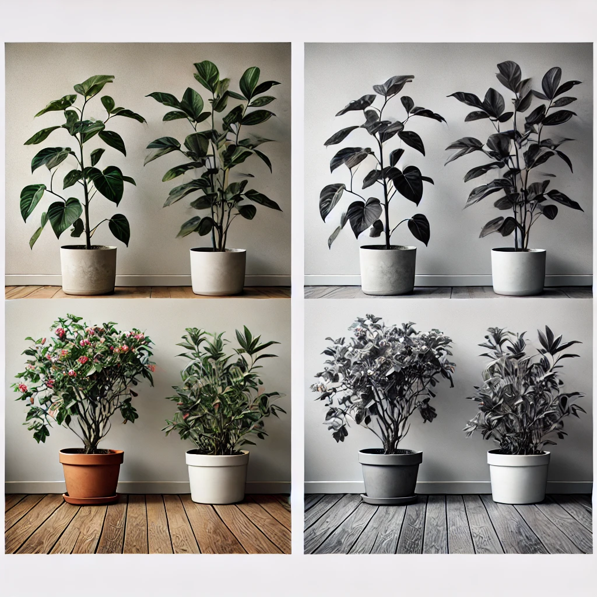

# Introduction

### Autonomous Turtlebot with Precision Watering System

This research project focuses on the development of an autonomous Turtlebot platform equipped with a precision water-dispensing system. The robot will navigate a structured indoor environment to identify and assess plants, determining both the necessity and appropriate quantity of water to apply. This system integrates advanced robotic navigation, computer vision, and AI-driven plant recognition to mimic the efficiency of precision agricultural technologies.

## Project Goals

The Turtlebot will:

- **Autonomously navigate** within a defined space using systematic navigation algorithms.
- Use **computer vision techniques** (e.g., fiducial marker detection via OpenCV) for localization and orientation.
- Leverage **OpenAI-based models** for plant type identification, enabling tailored watering strategies based on plant-specific hydration needs.
- Activate a **water sprayer actuator** to deliver a precise volume of water upon successful identification and analysis of the plant.

## Inspiration

- **Technological inspiration:** This project draws inspiration from advanced agricultural robotics, such as sniper robots capable of treating vast crop fields with unparalleled efficiency while using 95% fewer chemicals.
  - [Sniper robot treats 500k plants per hour with 95% less chemicals](https://www.youtube.com/watch?v=sV0cR_Nhac0&ab_channel=Freethink)
- **Personal relevance:** The project also addresses the common issue of plant neglect, inspired by Jiahao's experience with underhydrated and dying plants.

By combining robotics, AI, and precision actuation, this initiative explores innovative solutions for sustainable plant care in agricultural and domestic contexts.

## Objective

The objective of this project is to explore the integration of robotics, artificial intelligence, and precision actuation to solve real-world problems related to plant care and resource management. By leveraging autonomous navigation, image recognition, and intelligent decision-making systems, the project aims to:

- Demonstrate the feasibility of using robotics for sustainable, resource-efficient plant care.
- Develop a scalable framework for integrating AI-driven plant identification into robotic systems.
- Investigate and optimize strategies for precision watering to minimize waste while meeting plant-specific needs.
- Provide insights into the potential of robotic platforms in precision agriculture and domestic gardening.

This project serves as a proof of concept for innovative approaches to automated plant care, with broader implications for agricultural and environmental sustainability.

# Challenges

## Plant Detection

Ensuring that the Turtlebot reliably detects the target plant under varying lighting conditions (e.g., shadows or brightness changes) is a critical component of this project. The initial approach involved integrating a YOLOv5 model for real-time plant detection, leveraging resources such as the [Plant Leaf Detection and Classification model](https://huggingface.co/foduucom/plant-leaf-detection-and-classification). However, this approach revealed several limitations:

- **Accuracy**: The model struggled with detecting plants under diverse lighting conditions and varying angles.
- **Versatility**: It lacked adaptability to different environmental settings, which limited its practical application.
- **Computational Load**: The YOLOv5 model was computationally intensive, making it less suitable for real-time deployment on a resource-constrained platform like the Turtlebot.

To address these challenges, the project transitioned to using the **OpenAI GPT-4o-mini model** with advanced vision capabilities. This model demonstrated significantly improved performance by:

- Providing **consistent detection accuracy**, achieving nearly 100% reliability across diverse conditions.
- Offering **restricted outputs** tailored to specific plant identification, enhancing precision.
- Operating with **greater computational efficiency**, making it a more practical option since wew off-loaded the computation to an external api.

This refinement in plant detection methodology highlights the importance of balancing model accuracy, versatility, and computational feasibility in robotics applications. The GPT-4o-mini model proved to be a game-changer, ensuring robust and reliable plant identification for the Turtlebot's precision watering tasks. It can also detect an variety of objects outside of the plant constraints including an gatorade bottle.

Our project culture is to identify hard challenges and break it down with the simpliest solutions, so we avoided trainning an large detection modal by integrating and advanced vision model.

## Water Sprayer Signaling System:

Create a signaling channel for the turtlebot to control the sprayer through ROS. This requires hardware level development.

One of the biggest challenge for this project was to tackle hardware modifications as a team who has no experience in hardward work.

There are three main components that goes into making the sprayer remote controllable using ROS publisher.

1. arduino uno

2. relay

The relay is responsible for controlling the on and off of the circuit

3. soldering

[details](docs/faq/hardware/external_actuator_control.md)

## Water Spraying Mechanism Control:

Verifying that the water spraying actuator can be accurately triggered at the right time and location. The challenge is to time the activation properly and test its range to ensure it only targets specific areas.

## Autonomous Navigation:

Testing the Turtlebot’s ability to navigate and avoid obstacles reliably.
MVP is just walk in a line and detects plants, turn and spray, turnback
More advance to trace a given path (use a tape for the line)
IF enough time is available, we will use the slam algorithm to create an map for the navigation using A\*.

## Software

Technical descriptions, illustrations
Discussion of interesting algorithms, modules, techniques
Guide on how to use the code written
Tables listing names and one sentence purpose of each of these:
Python source files
Nodes created
Topics and their messages

# Story of the project.

How it unfolded, how the team worked together
Your own assessment
problems that were solved, pivots that had to be taken
